  

##  Hi, I am Toast Chen  	
  
Welcome to my profile!     
  

  

## 👨‍💻 About Me  

Hi, I am Toast Chen.  
  
You can also call me Toast.  
  
I am an undergraduated student of National Taiwan Normal University (NTNU), Taiwan.    
  
I major in computer science and information engineering.   

## 🎓Education  
+ Department of Computer Science and Information Engineering, National Taiwan Normal University, Taiwan

## 👨‍💻Employment History
+ Teaching Assistant | Data Science in Education Research (2025.03 ~ now)  
+ Machine Learninig Intern of ASCDC in Academia Sinica (2025.02 ~ 2026.02)  
+ Teaching Assistant | Theory of Probability (2025.09 ~ 2025.12)  

## 🏅Accomplishments
* 2025 ICPC Asia Taichung Regional Programming Contest：**Honorable Mention**
* 2025 ICPC Asia Taiwan Online Programming Contest (TOPC) : **Bronze Medal**
* 2025 **GDG Taipei Dev Jam** : **Honorable Mention** 
* CPE **5/7**
* 2024 **NTNUHackathon**
* High School Science Fair : Honorable Mention (In school)  

## 🪁Social Network & Leader Experience  
* 2025 GDG on campus NTNU  : Tech Core Team  
* 2025 NTNU CSIE Student Association : Technical Section
* 2025 NTNU CSIEcamp : Teaching Section, Technical Section
* 2024 NTNU CSIEcamp : Equipment Section  
* CLHS CLSC 12th : **Vice Director**  

## ⚙️ Tech stack
### 👨‍💻 Frontend 

### 👨‍💻 Backend  

### 👨‍💻 Database  

### 👨‍💻 DevOps 

### 💻 OS   

### 🧰 IDE

### ML
     

### ☁️ Cloud

 

### 👨‍💻 Others  

## 🏆 GitHub Activity  

<picture>
  <source media="(prefers-color-scheme: dark)" srcset="https://raw.githubusercontent.com/boyan1001/boyan1001/output/github-snake-dark.svg" />
  <source media="(prefers-color-scheme: light)" srcset="https://raw.githubusercontent.com/boyan1001/boyan1001/output/github-snake.svg" />
  
</picture>

## 💪 Support

