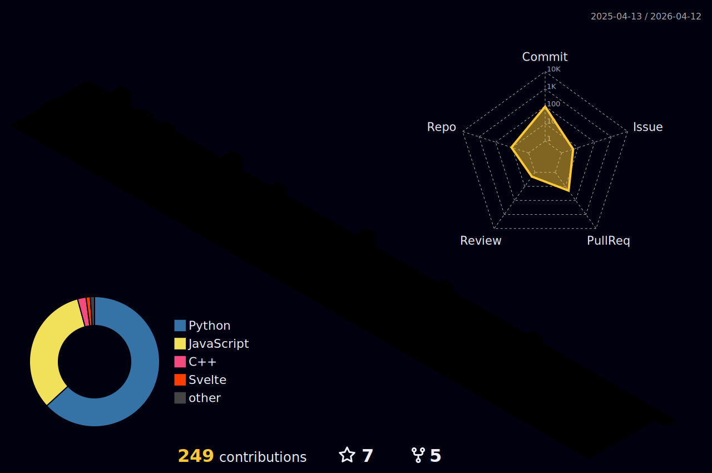

  

##  Hi, I am Toast Chen  	
[English](./README.md)  | [繁體中文](./README_zh-TW.md)  
  
歡迎來到我的個人檔案     
  

  

## 👨‍💻 關於我  
  
大家好，我是 Toast Chen，也可以叫我吐司。  

目前就讀**國立台灣師範大學 資訊工程學系** 大三。  

大學以前沒深入過資訊領域，現在正在努力地學習。  
  
## 🎓 學經歷  
+ 國立臺灣師範大學  資訊工程學系  
+ 國立中央大學附屬中壢高級中學

## 💼 工作經驗  
+ 中央研究院: **長期實習生**
+ 家教  

## 🏅 比賽經驗
* 2024 國立臺灣師範大學 第十二屆程式設計通識課程 : **專題特優獎**
* CPE **5題**
* 2024 **師大資工黑客松**
* 2025 **GDG Taipei Dev Jam** : 決賽佳作
* 2022(111) 學科能力競賽 地球科學科 : **全國決賽三等獎(全國第17名)**
* 高中科展 : 佳作 (校內)  

## 🪁 社團活動與表現  
* 中壢高中科學研究社 : **副社長**
* SITCON 師大資工攤位 : **籌備**
* NTNU CSIE Universe : **管理員**
* 2025 師大資工營 : 教學股 / 研發組
* 2024 師大資工營 : 場器股   

<!-- 

  

 -->

## ⚙️ 技能  
### 👨‍💻 前端 

### 👨‍💻 後端  

### 👨‍💻 Devlop  

### 💻 環境  

### 🧰 開發工具 

### 👨‍💻 其他  

## 🏆 GitHub 活動統計  

	

